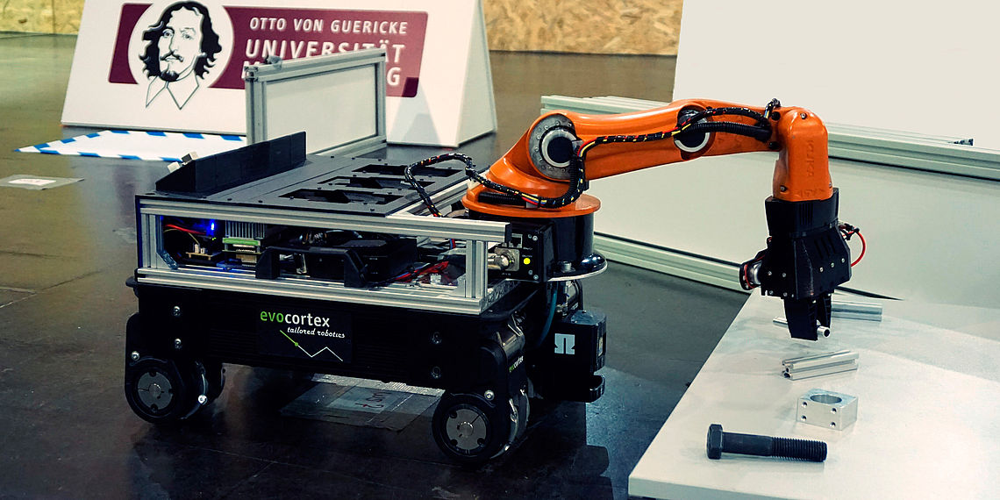
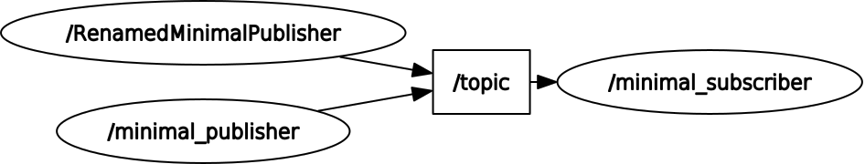
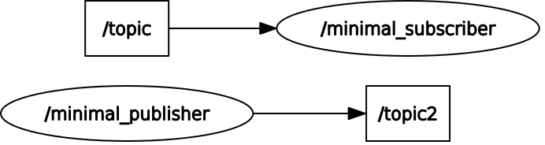

<!--

author:   Sebastian Zug & Georg Jäger
email:    sebastian.zug@informatik.tu-freiberg.de & Georg.Jaeger@informatik.tu-freiberg.de
version:  0.0.1
language: de
narrator: Deutsch Female

import: https://raw.githubusercontent.com/LiaTemplates/Rextester/master/README.md

-->

# Vorlesung Advanced Programming - Teil 3

In dieser und der nächsten Folge wollen wir Ihnen einen Überblick zum Robot Operating System (ROS) geben und dabei insbesondere den Unterschied zwischen ROS 1 und ROS 2 herausarbeiten.

Eine interaktive Version des Kurses finden Sie unter [Link](https://liascript.github.io/course/?https://raw.githubusercontent.com/SebastianZug/AdvancedProgramming/master/Cplusplus.md#1)

**Informationen zur Prüfung**

Als Termine für die mündlichen Prüfungen bieten wir folgende Zeitslots an:

| Tag | Datum | Uhrzeit |
|:----|:------|:--------|
| Montag | 27.07.2020 | 10 Uhr | 
| Freitag | 31.07.2020 | 10 Uhr |
|  |   | 13 Uhr |
| Montag | 3.08.2020 | 10 Uhr |
|  |   | 11 Uhr |
|  |   | 13 Uhr |
| Freitag |  7.08.2020 | 10 Uhr |
| Freitag |  7.08.2020 | 11 Uhr |

Sprechen Sie uns rechtzeitig an, wenn Sie einen späteren Zeitpunkt vorziehen würden.

Die Prüfung besteht aus einer kurzen Programmieraufgabe, die in einer 30minütigen Vorbereitungszeit zu bearbeiten ist. Die Lösung ist Ausgangspunkt einer Diskussion über die konzeptionellen Hintergründe. Darauf folgen weitere Fragestellungen zu den Inhalten der Vorlesung.

**Zielstellung der heutigen Veranstaltung**

+ Spezifische Anforderungen an Frameworks für die Arbeit mit Robotern
+ Basiskonzepte von ROS
+ Unterschiede von ROS1 und ROS2

--------------------------------------------------------------------------------

## Frameworks um Roboter zu programmieren?

                                   {{0-1}}
********************************************************************************

**Welche Herausforderungen stecken in der Programmierung eines Roboters?**

<!-- width="100%" -->
*Roboter des RoboCupTeams aus Nürnberg* [^1]

[^1]: TDP des Teams AutonOhm, 2019

********************************************************************************


                                  {{1-2}}
********************************************************************************

<!-- width="80%" -->
Comic auf der Webseite der Firma Willow Garage, das die individuellen Frameworks
für die Robotikentwicklung adressiert. [^2]

[^2]: Willow Garage, http://www.willowgarage.com/blog/2010/04/27/reinventing-wheel, 2010

********************************************************************************


### Vergleich von Frameworks

                                  {{0-1}}
********************************************************************************

1. Hardwareunterstützung und Laufzeitumgebung

+ **Betriebssystem** Eine Robotikentwicklungsumgebung sollte mehrere Betriebssysteme und dabei eine möglichst umfangreiche Abdeckung für häufig genutzte Bibliotheken, Komponenten oder Hardwaretreiber bieten.

+ **Unterstützung ressourcenbeschränkter Systeme** Die Interaktion und Kooperation mit ressourcenbeschränkten Systemen ist u.a. in Bereichen gefragt, in denen z.B. die Effizienz und Kosten der eingesetzten Komponenten eine tragende Rolle spielen. Für ein breites Anwendungsspektrum des jeweiligen Frameworks ist eine entsprechende Unterstützung solcher Systeme wünschenswert.

+ **Echtzeitfähigkeit** Robotikanwendungen umfassen häufig Anwendungselemente, die harte Echtzeitanforderungen an die Verarbeitung stellen. Regelschleifen zur Ansteuerung von Manipulatoren benötigen, um stabil zu laufen, ein deterministisches Zeitverhalten.

+ **Treiberintegration** Ein Framework sollte nicht nur eine die Vielfalt an Sensoren und Aktoren, sondern auch konkrete Robotersysteme spezifischer Hersteller, die auf diesen Komponenten aufsetzen, unterstützen.

********************************************************************************

                                  {{1-2}}
********************************************************************************

2. Kommunikation

+ **Kommunikationsmiddleware** Damit Anwendungen verteilt über mehrere Rechnerknoten laufen können und somit eine Ortsunabhängigkeit gewährleisten, sind entsprechende Mechanismen erforderlich.

+ **Kommunikationsparadigmen** Im Kontext einer Anwendung ist die Abdeckung unterschiedlicher Formen für den Nachrichtenaustausch zwischen den Komponenten wünschenswert. Als Interaktionsmuster sind die *Client-Server-Beziehung* und das *Publish-Subscribe-Modell* denkbar.

+ **Echtzeitfähigkeit** Anknüpfend an die Echtzeitfähigkeit der Laufzeitumgebung ist das deterministische Verhalten der Kommunikationsverbindungen Voraussetzung für die Entwicklung zeitkritischer Systeme.

********************************************************************************

                                  {{2-3}}
********************************************************************************

3. Programmierung

+ **Unterstützte Programmiersprachen**  Bei der Anwendungsentwicklung sollte dem Entwickler möglichst die Wahl gelassen werden, in welcher Programmiersprache entwickelt wird. Eine domain-spezifische Frage zielt dabei auf die Möglichkeit der grafischen Programmierung.

+ **Unterstützungsbibliotheken** Vordefinierte Komponenten z.B. für Pfadplanung, Verhaltensauswahl und Lokalisierung erleichtern den Entwicklungsprozess und fördern die Wiederverwendung von Software-Modulen, wobei gegebenenfalls entsprechende Anpassungen erforderlich sind.

+ **Erweiterbarkeit** Erweiterbarkeit bedeutet hier die Unterstützung für das Hinzufügen neuer Software-Module und neuer Hardware-Komponenten in das bestehende Rahmenwerk.

+ **Lizenzmodell** Der Typ der Lizenz der Frameworks bestimmt insbesondere im Fall der kommerziellen Nutzung über deren generelle Anwendbarkeit. Durch das gewählte Lizenzmodell wird die Breite der Entwicklungs-Community zumindest mitbestimmt. Eine aktive Community erleichtert die Entwicklungsarbeit und bieten in Wikis oder Foren eine Vielzahl von Antworten, Anregungen und Beispielcode.

********************************************************************************

                                  {{3-4}}
********************************************************************************

4. Test und Debugging

+ **Monitoring** Die Überwachung der einzelnen Komponenten und deren Beziehungen zueinander muss in einem übergreifenden Ansatz möglich sein, um komfortabel Aussagen über den Status des Robotersystemes. Eine grafische Schnittstelle, die die Visualisierung einzelner Komponenten, des Gesamtsystems oder einzelner Parameter übernimmt, vereinfacht die Entwicklung erheblich.

+ **Logging** Das Logging der Anwendungsoperation unterstützt einerseits das Debugging und ermöglicht andererseits eine Wiederholung dieser Anwendungsausführung im Sinne eines Wiederabspielens einer Aufzeichnung. Somit wird eine Offline-Analyse der implementierten Funktionalitäten möglich, sodass auch Aussagen über die Performance dieser bzw. des Gesamtsystems getroffen werden können.

+ **Simulation** Die Simulation der realen Welt ermöglicht es den Entwicklern, ihre Anwendungen zu testen, ohne die entsprechende Hardware besitzen zu müssen, indem diese geeignet modelliert wird. Die Simulatoren können dabei in Form von „einfachen“ zweidimensionalen bis hin zu komplexen 3-D-Umsetzungen mit realistischen physikalischen Gegebenheiten vorliegen.


********************************************************************************

                                  {{4-5}}
********************************************************************************

Eine zeitliche Entwicklung wird in folgendem (zeitlich etwas veralteten) Diagramm
deutlich:

<!-- width="80%" -->
*Entwicklungspfade verschiedener Robotikframeworks* [^2]

[^2]: Analyse und Vergleich von Frameworks für die Implementierung von Robotikanwendungen / Sebastian Zug ... Fakultät für Informatik, Otto-von-Guericke-Universität Magdeburg Zug, Sebastin ; Poltrock, Thomas ; Penzlin, Felix ; Walter, Christoph ; Hochgeschwender, Nico; 2013; [Link](http://digital.bibliothek.uni-halle.de/pe/content/titleinfo/2361399)

Einen Überblick über weitere Robotikframeworks bietet zum Beispiel die Arbeit von Pericles und Mitkas:

*Tsardoulias, Emmanouil & Mitkas, Pericles. (2017). Robotic frameworks, architectures and middleware comparison.*

die unter folgendem Link zu finden ist [Link](https://www.researchgate.net/publication/321180717_Robotic_frameworks_architectures_and_middleware_comparison) zu finden.

********************************************************************************

## ROS, was ist das?

Robot Operating System (ROS) ist ein Framework für die Entwicklung von Robotern. Dabei ist ROS kein Betriebssystem sondern eine Middleware mit aufgesetzter Paketstruktur. Im Juli 2019 listeten die Statistiken mehrere tausend Repositories und Pakete. ROS wird unter der BSD-Lizenz veröffentlicht und ist somit der Open-Source-Szene zuzuordnen.

Die Entwicklung begann 2007 am Stanford Artificial Intelligence Laboratory im Rahmen des Stanford-AI-Robot-Projektes (STAIR) und wurde ab 2009 hauptsächlich am Robotikinstitut Willow Garage weiterentwickelt. Seit April 2012 wird ROS von der neu gegründeten, gemeinnützigen Organisation Open Source Robotics Foundation (OSRF) unterstützt und seit Beendigung der operativen Tätigkeit von Willow Garage 2013 von dieser koordiniert, gepflegt und weiterentwickelt.

Die Hauptbestandteile und -aufgaben von ROS sind:

+ Hardwareabstraktion
+ Gerätetreiber
+ oft wiederverwendete Funktionalität
+ Nachrichtenaustausch zwischen Programmen bzw. Programmteilen
+ Paketverwaltung
+ Programmbibliotheken zum Verwalten und Betreiben der Software auf mehreren Computern

Die Webseite von ROS findet sich unter [ROS](https://www.ros.org/).

Seit 2013 beschäftigt sich das ROS Industrial Consortium mit der Förderung und Unterstützung von ROS für Anwendungen in der Industrierobotik. In Europa koordiniert das Fraunhofer IPA (Stuttgart) die Aktivitäten des ROS Industrial Consortium Europe.

Seit Beginn der Entwicklung von ROS 2.0 wird zwischen ROS 1 und ROS 2 unterschieden. Die beiden Hauptversionen sind nicht miteinander kompatibel, jedoch interoperabel und können parallel ausgeführt werden.

Die aktuellen Versionen sind

+ ROS1 - Melodic Morenia (melodische Pfauenaugen-Sumpfschildkröte) veröffentlicht im Mai 2018 und
+ ROS2 - Foxy Fitzroy Veröffentlichung im Juni 2020.

>  In der Fachwelt für das autonome Fahren werden auch gerne zumindest Teile von ROS eingesetzt. In der Robotik nutzen mittlerweile nahezu alle Forschungsgruppen zumindest teilweise ROS. Viele Forschungsgruppen besitzen gar kein eigenes Softwareframework mehr, sondern konzentrieren sich voll auf ROS. *golem.de [Beitrag - Für wen ist ROS?](https://www.golem.de/news/robot-operating-system-was-bratwurst-bot-und-autonome-autos-gemeinsam-haben-1612-124079-4.html)*

Das erste Paper, in dem die Basiskonzepte beschrieben wurden, ist unter [Link](http://www.robotics.stanford.edu/~ang/papers/icraoss09-ROS.pdf) zu finden.

###  ROS 1 vs. ROS 2

| Merkmal                     | ROS1                                                                                     | ROS2                                                                                                                                                                             |
|:----------------------------|:-----------------------------------------------------------------------------------------|:---------------------------------------------------------------------------------------------------------------------------------------------------------------------------------|
| Betriebssysteme             | Linux (Ubuntu, Gentoo, Debian), OS X                                                     | Linux  (Ubuntu), OS X, Windows 10                                                                                                                                                |
| Programmiersprachen C       | C++03                                                                                    | C++11 (einzelne Konzepte von C++14)                                                                                                                                              |
| Programmiersprachen Python  | Python 2                                                                                 | Python 3.5                                                                                                                                                                       |
| Middleware                  | eigene Konzepte für den Datenaustausch                                                   | abstraktes Middlewarekonzept offen für spezifische Lösungen (aktuell DDS als Default-Implementierung), mit einem geeigneten Middleware-Ansatz sind Echtzeitanwendungen umsetzbar |
| Build System                | [CMake](https://cmake.org/) Projekte mit [catkin](https://docs.ros.org/api/catkin/html/) | CMake Projekte (mit colcon), andere Systeme können integriert werden                                                                                                             |
| Paketstruktur               | Integrierende Pakete möglich                                                             | aus Gründen der automatisierten Auflösung von Abhängigkeiten nur isolierte Pakete                                                                                                |
| Message/Service Deklaration | Messageformatdefinitionen auf der Basis von Grundtypen,                                  | einheitliche Namen in Python und C++, default Werte, separate Namespaces für Services und Messages, einheitliche Zeittypen für die APIs                                          |
| Systemkonfiguration         | XML Beschreibungen                                                                       | Python Code für den Systemstart mit komplexen Logiken                                                                                                                            |
| Node vs. Nodelet            | unterschiedliche APIs für beide Konzepte                                                 | Implementierungen zielen auf eine Shared Library - es wird zur Laufzeit entschieden, ob diese als separater Prozess oder innerhalb eines Prozesses ausgeführt wird.              |

Einen Überblick zu den genannten Features gibt die Webseite [Link](http://design.ros2.org/articles/changes.html)

                                           {{1-2}}
*******************************************************************************
**Ersetzt ROS2 als ROS1 vollständig?**

> *The quick answer is: Yes but with drawbacks. So ROS2 Crystal has worked with the new GAzebo with ROS2 support, so you have access to creating your own simulations using only ROS2. You have access to the main ROS packages like tf, navigation, image_transport, rqt, and the big RVIZ. So it would seem that 90% of the current ROS users would be satisfied. ...*

> *But the reality is that a huge amount of packages don’t come out of the box working for ROS2 or are installed through debians.* [^Ref]

[^Ref]: The Construct, "ROS2 vs ROS1? Or more like ROS2 + ROS1?" https://www.theconstructsim.com/ros2-vs-ros1/, 2018

Unterstützung bietet dabei ein Paket `ros1_bridge`, das die Kommunikation zwischen einem ROS1 und einen ROS2 Graphen
sicherstellt.

*******************************************************************************

### Wie kann man sich in ROS einarbeiten?

                                 {{0-4}}
*******************************************************************************

1. Das offizielle ROS-Tutorial-Website ist sehr umfangreich und in mehreren Sprachen verfügbar. Es enthält Details zur ROS-Installation, Dokumentation von ROS, etc. und ist völlig kostenlos.  Dabei lauern aber einige Fallstricke:

   * Achten Sie immer, wenn Sie sich in ein Beispiel einlesen auf die zugehörige ROS-Versionsnummer!
   * Prüfen Sie Abhängigkeiten und die Aktualität der Bibliotheken.
   * Informieren Sie sich darüber in wie weit an dem Paket aktuell noch gearbeitet wird. Letzte Commits vor einigen Monaten sind immer ein schlechtes Zeichen :-)

| ROS2                                                | ROS1                               | Hintergrund                  |
|:----------------------------------------------------|:-----------------------------------|:-----------------------------|
| https://index.ros.org/doc/ros2/                     | http://wiki.ros.org/               | Hauptseite des Projektes OSF |
| https://discourse.ros.org/                          | https://answers.ros.org/questions/ | ROS Forum                    |
| https://index.ros.org/doc/ros2/Tutorials/#tutorials | http://wiki.ros.org/ROS/Tutorials  | ROS Tutorials                |

*******************************************************************************

                                 {{1-4}}
*******************************************************************************

2. Es existiert eine Vielzahl von Tutorials in Form von Videos, die einen Überblick versprechen oder einzelne Themen individuell adressieren.

| Titel                    | Inhalt                                                              | Link                                                                                        |
|:-------------------------|:--------------------------------------------------------------------|:--------------------------------------------------------------------------------------------|
| ROS tutorial #1          | Installation, erste Schritte                                        | [Link](https://www.youtube.com/watch?v=9U6GDonGFHw&t=72s)                                   |
| Programming for Robotics | 5 Kurse als Einführung in ROS1 der ETH Zürich                       | [Link](https://www.youtube.com/watch?v=0BxVPCInS3M&list=PLE-BQwvVGf8HOvwXPgtDfWoxd4Cc6ghiP) |
| ROS2 Tutorials           | Tutorial des kommerziell orientierten Kursanbieters "The Construct" | [Link](https://www.youtube.com/playlist?list=PLK0b4e05LnzYNBzqXNm9vFD9YXWp6honJ)            |

*******************************************************************************

                                 {{2-4}}
*******************************************************************************

3. Verschiedene Hochschulen und Institutionen bieten Kurse und Summer Schools an. Die spezifische Ausrichtung wie auch die Gebühren schwanken stark.

*******************************************************************************

                                 {{3-4}}
*******************************************************************************

4. Das Angebot an Literatur über ROS ist überschaubar, zu ROS2 existieren bisher nur wenige Publikationen. Zu empfehlen ist das Buch von Newmann "A Systematic Approach to Learning Robot Programming with ROS" oder aber von Kane "A Gentle Introduction to ROS". Letzteres ist online unter [Link](https://cse.sc.edu/~jokane/agitr/agitr-letter.pdf) zu finden.

*******************************************************************************

## Was ist eigentlich eine Middleware?

                         {{0-1}}
********************************************************************************

> Middleware im Kontext verteilter Anwendungen ist eine Software, die über die vom Betriebssystem bereitgestellten Dienste hinaus Dienste bereitstellt, um den verschiedenen Komponenten eines verteilten Systems die Kommunikation und Verwaltung von Daten zu ermöglichen.

Middleware unterstützt und vereinfacht komplexe verteilte Anwendungen, sonst müsste die Anwendung Fragen wie:

+ Welche Informationen sind verfügbar?
+ In welchem Format liegen die Daten vor, bzw. wie muss ich meine Informationen verpacken?
+ Wer bietet die Informationen an?
+ Welche Laufzeit haben die Daten maximal?
...

Eine Middleware befreit die Applikation davon diese Frage zu beantworten. Vielmehr bieten Middleware-Dienste  einen Satz von Programmierschnittstellen, um einer Anwendung:

+ eine beliebige "Lokalisierung" im gesamten Netzwerk zu ermöglichen
+ eine standardisierte Interaktion mit einem anderen Dienst oder einer anderen Anwendung umzusetzen
+ Daten zu filtern (Inhalte, Autorisierung)
+ eine unabhängigen Netzzugriff unabhängig vom Netztyp sicherzustellen
+ einen zuverlässigen Datenaustausch sicherzustellen.

********************************************************************************

                         {{1-2}}
********************************************************************************

__Und in ROS2?__

Für die Realisierung dieser Aufgabe stehen unterschiedlichen Lösungsansätze mit
verschiedenen Schwerpunktsetzungen bereit. Entsprechend integriert ROS2 ein
abstraktes Interface für ein Einbettung von Middelware-Lösungen, die den DDS Standard implementieren.

DDS stellt einen "Globalen Daten Raum" zur Verfügung, der diese allen interessierten
verteilten Anwendungen zur Verfügung stellt.

+ Datenobjekte werden mit einer Domain-ID, einem Topic und einen Schlüssel adressiert.
+ Die Nachfrager (Subscriber) sind von den Produzenten (Publisher) entkoppelt.
+ Filter ermöglichen die inhaltliche Definition von relevanten Informationen auf Subscriberseite.
+ Die Verbindung wird über _Contracts_ spezifiziert, die die _Quality_ _of_ _Service_ (QoS) definiert
+ Die Verbindung zwischen Subscribern und Publishern wird automatisch hergestellt.

Der DDS Standard wurde durch verschiedene Unternehmen und Organisationen unter dem Dach der Object Management Group vorangetrieben. Eine Beschreibung findet sich unter [Link](https://www.omg.org/spec/DDS/).

********************************************************************************

                         {{2-3}}
********************************************************************************

ROS2 hat als Default Lösung die Implementierung `rmw_fastrtps_cpp`, die von der Firma eProsima unter einer Appache 2.0 Lizenz verbreitet wird, integriert. Alternative Umsetzungen lassen sich anhand der unterstützten Hardware, des Overheads für den Nachrichtenaustausch bzw. anhand der Dauer für die Nachrichtenverbreitung abgrenzen. (vgl [A performance comparsion of OpenSplice and RTI implementations](https://www.researchgate.net/publication/271550363_Data_Distribution_Service_DDS_A_performance_comparison_of_OpenSplice_and_RTI_implementations)). Daher sieht ROS2 ein abstraktes Interface vor, dass ein Maximum an Austauschbarkeit gewährleisten soll.

vgl. https://index.ros.org/doc/ros2/Concepts/DDS-and-ROS-middleware-implementations/

<!--
style="width: 80%; max-width: 860px; display: block; margin-left: auto; margin-right: auto;"
-->
```ascii

              User Applications
+---------+---------+---------+
| rclcpp  | rclpy   | rcljava | ...
+---------+---------+---------+-----------------------------+
| rcl (C API) ROS client library interface                  |
| Services, Parameters, Time, Names ...                     |
+-----------------------------------------------------------+
| rmw (C API) ROS middleware interface                      |
| Pub/Sub, Services, Discovery, ...                         |
+-----------+-----------+-------------+-----+---------------+
| DDS       | DDS       | DDS         | ... | Intra-process |
| Adapter 0 | Adapter 1 | Adapter 2   |     |      API      |
+-----------+-----------+-------------+     +---------------+
| FastRTPS  | RTI       | PrismTech   | ...
|           | Context   | OpenSplice  |
+-----------+-----------+-------------+

```

********************************************************************************

                         {{3-4}}
********************************************************************************

Welche Aufgaben bildet DDS für ROS2 über entsprechende Schnittstellen ab?

__Discovery__ ... DDS ist vollständig verteilt, auch auf der Ebene des Discovery Systems und steht damit im Unterschied zu ROS1, dass ein zentrales Koordinationselemente `roscore` einsetzte. Damit entfällt der zentralen Fehlerpunkt, der für die Kommunikation zwischen Teilen des Systems erforderlich ist.

    1. Wenn ein Knoten gestartet wird, wirbt er für seine Anwesenheit bei anderen Knoten im Netzwerk mit derselben ROS-Domäne (gesetzt mit der Umgebungsvariablen `ROS_DOMAIN_ID`). Knoten reagieren auf diese Werbung mit Informationen über sich selbst, damit die entsprechenden Verbindungen hergestellt werden können und die Knoten kommunizieren können.

    2. Knoten bewerben ihre Präsenz regelmäßig, so dass auch nach der ersten Erkundungsphase Verbindungen zu neu gefundenen Einheiten hergestellt werden können.

    3. Knoten informieren die anderen Knoten, wenn sie offline gehen.

__Publish/Subscribe__ ... DDS implmentiert das Publish/Subscribe Paradigma in Kombination mit Quality of Service Attributen. Diese dienen der Koordination des Datenaustausches unter Berücksichtigung von zwingenden Anforderungen des Subscribers bzw. dem Verhalten des Publishers.

__Services and Actions__ ... DDS verfügt derzeit nicht über einen Request-Response-Mechanismus, mit dem die entsprechenden Konzept der Dienste in ROS umgesetzt werden könnten. Derzeit wird in der OMG DDS-Arbeitsgruppe eine RPC-Spezifikation zur Ratifizierung geprüft, und mehrere der DDS-Anbieter haben einen Entwurf für die Implementierung der RPC-API.

********************************************************************************

                         {{4-5}}
********************************************************************************


__Welche Rolle spielen die QoS Eigenschaften des Kommunkations-Layers?__

ROS 2 bietet eine Vielzahl von Quality of Service (QoS)-Richtlinien, mit denen Sie die Kommunikation zwischen Knoten und die Datenhaltung optimieren können. Im Gegensatz zu ROS1, das vorrangig auf TCP setzte, kann ROS2 von Transparenz der jeweiligen DDS-Implementierungen profitieren.

Eine Reihe von QoS "Richtlinien" kombinieren sich zu einem QoS "Profil". Angesichts der Komplexität der Auswahl der richtigen QoS-Richtlinien für ein bestimmtes Szenario bietet ROS 2 einen Satz vordefinierter QoS-Profile für gängige Anwendungsfälle (z.B. Sensordaten). Gleichzeitig erhalten die Benutzer die Flexibilität, spezifische Profile der QoS-Richtlinien zu steuern.

QoS-Profile können für Publisher, Abonnenten, Service-Server und Clients angegeben werden. Damit wird die kombinierbarkeit der Komponenten unter Umständen eingeschränkt!

https://index.ros.org/doc/ros2/Concepts/About-Quality-of-Service-Settings/

https://index.ros.org/doc/ros2/Tutorials/Quality-of-Service/


DDS ist ein Beispiel, alternative

+ *Durability* ... legt fest, ob und wie lange Daten, die bereits ausgetauscht worden sind,  "am Leben bleiben". `volatile` bedeutet, dass dahingehend kein Aufwand investiert wird, `transient` oder `persistent` gehen darüber hinaus.
+ *Reliability* ...  Die Reliability-QoS definiert, ob alle geschriebenen Datensätze (irgendwann) bei allen Readern angekommen sein müssen. Bei zuverlässiger (`reliable`) Kommunikation werden geschriebene Datensätze eines Topics, die aus irgendwelchen Gründen auf dem Netzwerk verloren gehen, von der Middleware wiederhergestellt, um diese Daten verlässlich den Readern zustellen zu können. Im Unterschied dazu definiert `best effort` eine schnellstmögliche Zustellung.
+ *History* ... definiert, wie viele der letzten zu sendenden Daten und empfangenen Daten gespeichert werden. `Keep last` speichert n Samples, wobei die n durch den QoS Parameter _Depth_ definiert wird. `Keep all` speichert alle Samples
+ *Depth* ... erfasst die Größe der Queue für die History fest, wenn `Keep last` gewählt wurde.

| Konfiguration          | Durability | Reliability | History   | Depth  |
| ---------------------- | ---------- | ----------- | --------- | ------ |
| Publisher & Subscriber | volatile   | reliable    | keep last | -      |
| Services               | volatile   | reliable    | keep last |        |
| Sensor data            | volatile   | best effort | keep last | small  |
| Parameters             | volatile   | reliable    | keep last | larger |
| Default                | volatile   | reliable    | keep last | small  |

Quelle: https://github.com/ros2/rmw/blob/release-latest/rmw/include/rmw/qos_profiles.h

Die QoS Parameter werden gegeneinander abgewogen und ggf. abgestimmt.

| Publisher   | Subscriber  | Verbindung | Result      |
| ----------- | ----------- | ---------- | ----------- |
| best effort | best effort | ja         | best effort |
| best effort | reliable    | nein       |             |
| reliable    | best effort | ja         | best effort |
| reliable    | reliable    | ja         | reliable    |

Evaluieren Sie die QoS Mechanismen, in dem Sie die Qualität Ihrer Netzverbindung
manipulieren. Eine Anleitung findet sich zum Beispiel unter [Link](https://index.ros.org/doc/ros2/Tutorials/Quality-of-Service/)

********************************************************************************


## Basiskonzepte

**Pakete** - Pakete kapseln einzelne Algorithmen und realisieren deren Abhängigkeiten. Letztendlich wird damit die Wiederverwendbarkeit einer Implementierung gewährleistet.

https://fkromer.github.io/awesome-ros2/

**Node** - Ein Knoten ist Teilnehmer im ROS-Graphen. ROS-Knoten verwenden eine ROS-Clientbibliothek, um mit anderen Knoten zu kommunizieren. Knoten können ein *Subject* veröffentlichen oder abonnieren. *Nodes* können auch einen Dienst bereitstellen oder verwenden. Einem Knoten sind konfigurierbare Parameter zugeordnet. Verbindungen zwischen Knoten werden durch einen verteilten Erkennungsprozess hergestellt. Knoten können sich im selben Prozess, in unterschiedlichen Prozessen oder auf unterschiedlichen Rechnern befinden.

<!-- width="100%" -->
*Screenshot der Knoten eines umfangreicheren Projektes. Die Ellipsen repräsentieren die Knoten, die rechteckigen Boxen die "Datenkanäle" dazwischen.* [

**Discovery** - Die Erkennung von *Nodes* erfolgt automatisch über die zugrunde liegende Middleware von ROS2. Dafür sind folgende Punkte zu beachten

+ Wenn ein Knoten gestartet wird, kündigt er seine Anwesenheit anderen Knoten im Netzwerk mit derselben ROS-Domäne an (festgelegt mit der Umgebungsvariablen `ROS_DOMAIN_ID`). Knoten antworten auf diese Ankündigung mit Informationen über sich selbst, so dass die entsprechenden Verbindungen hergestellt werden können und die Knoten kommunizieren können.

+  Knoten informieren regelmäßig über ihre Anwesenheit, damit Verbindungen zu neu erscheinenden Entitäten hergestellt werden können, die während des eigenen Starts noch nicht aktiv waren.

+ Knoten stellen nur dann Verbindungen zu anderen Knoten her, wenn diese über kompatible Quality of Service-Einstellungen verfügen.

**Topics** - Topics repräsentieren den Inhalt einer Nachricht und erlauben damit die Entkopplung von Informationsquelle und Informationssenke. Die Knoten brauchen nicht zu wissen, mit wem sie kommunizieren, allein das "Label" oder "Thema" genügt.  *Topics* sind für die unidirektionale, streamende Kommunikation gedacht. *Nodes*, die *Remote Procedure Calls* durchführen müssen, d.h. eine Antwort auf eine Anfrage erhalten, sollten stattdessen *Services* verwenden.

<!--
style="width: 80%; max-width: 860px; display: block; margin-left: auto; margin-right: auto;"
-->
```ascii

Publisher "scans"                Subscriber "scans"
                                 Publisher "speed"

+-------------------+
|Laserscanner Front | -----.
+-------------------+      |
                           |     +---------------------+
                           +---> | Obstacle Detection  |----->
                           |     +---------------------+
+-------------------+      |
| Laserscanner Back | -----+
+-------------------+      |     +---------------------+
                           +---> | Leg Detection       |
                                 |                     |----->
                           +---> |                     |
+-------------------+      |     +---------------------+
| Laserscanner Left | -----+
+-------------------+

Publisher "FrontCloud"           Publisher "human"

```

**Messages** - Um die Kommunikation von Datenpaketen zwischen den Knoten zu ermöglichen, muss deren Aufbau und inhaltliches Format spezifiziert werden. Welche Datenformate werden verwendet, wo befindet sich der versendende Sensor, welche Maßeinheiten bilden die Informationen ab? ROS definiert dafür abstrakte Message-Typen.

<!--
style="width: 80%; max-width: 860px; display: block; margin-left: auto; margin-right: auto;"
-->
```ascii

Publisher "dist"                             Subscriber "dist"

+------------+       .---------------.       +------------+
| Node 1     | ----> | Message       | ----> | Node 2     |
+------------+       |  Float32 data |       +------------+
                     |  Int     type |
                     .---------------.
 Distance sensor                             Speed control
```

Die ROS2 Message-Spezifikation integriert verschiedene Konfigurationsmöglichkeiten. Auf der obersten Ebene sind dies einfache Namens- und Typzuweisungen. Dabei wird zwischen sogenannten Built-in Typen und nutzerspezifischen Typen unterschieden. Feldnamen müssen klein geschriebene alphanumerische Zeichen mit Unterstrichen zur Trennung von Wörtern sein. Die Typdefinitionen der Basistypen erfolgen anhand "C++ naher" Bezeichner (`bool`, `char`, `float32` usw. )

Komplexe Typen werden wie folgt spezifiziert

| Index | ROS2 msg Type           | C++                 |
|:----- |:----------------------- |:------------------- |
| 0     | zB. `float32`           | `float`             |
| 1     | `string`                | `std::string`       |
| 2     | static array            | `std::array<T, N>`  |
| 3     | unbounded dynamic array | `std::vector<T>`    |
| 4     | bounded dynamic array   | `custom_class<T,N>` |
| 5     | bounded string array    | `std::string`       |


Im folgenden sollen Beispiele die

```
# Basic format: fieldtype1 fieldname1
# Type 0, 1 examples:
int32 my_int
string my_string

# Type 2
int32[5] five_integers_array
# Type 3
int32[] unbounded_integer_array
# Type 4
int32[<=5] up_to_five_integers_array

# Type 5
string<=10 up_to_ten_characters_string
string[<=5] up_to_five_unbounded_strings
string<=10[] unbounded_array_of_string_up_to_ten_characters each
string<=10[<=5] up_to_five_strings_up_to_ten_characters_each
```

Eine weitere Neuerung besteht in der Möglichkeit Default-Werte und Konstanten zu definieren.

```
# Field default values
uint8 x 42
int16 y -2000
string full_name "John Doe"
int32[] samples [-200, -100, 0, 100, 200]

# Constant values with "="
int32 X=123
string FOO="foo"
```

Eigene Messagetypen umfassen üblicherweise eine Hierarchie von Messages und Sub-Messages. Untersuchen Sie zum Beispiel das Standard-Laserscanner Nachrichtenformat:

```
> ros2 msg show sensor_msgs/msg/LaserScan
```

Knoten, die einen Wert publizieren lassen sich neben den Programmen auch auf der
Kommandozeile erzeugen. Damit besteht für Tests eigener Subscriber die Möglichkeit diese sehr einfach mit spezifischen Nachrichten zu triggern.

```
ros2 topic pub /test s
```


**Worin unterscheiden sich ROS1 und ROS2 in Bezug auf diese Konzepte?**

Einen Überblick bietet die Webseite unter folgendem [Link](http://design.ros2.org/articles/interface_definition.html)

| Parameter           | ROS2 node                                                                                      | ROS1 node                                                                                      |
|:--------------------|:-----------------------------------------------------------------------------------------------|:-----------------------------------------------------------------------------------------------|
| Zweck               | Ausführbares Programm im ROS1 Kontext, das in der Lage ist mit anderen Knoten zu kommunizieren | Ausführbares Programm im ROS1 Kontext, das in der Lage ist mit anderen Knoten zu kommunizieren |
| Discovery           | Verteilte Discovery-Mechanismen (die nicht von einem einzelnen Knoten abhängen)                | ROS Master als zentrale Verwaltungsinstanz der Kommunikation                                   |
| Client Bibliotheken | `rclcpp` = C++ client Library, `rclpy` = Python client library C++                             | `roscpp` = C++ client Library, `rospy` = Python client library                                 |

## Einführungsbeispiele

**Arbeit auf der Konsole**

Die Exploration und Untersuchung eines ROS2 Systems erfolgt mittels des Tools "ros2". Mit diesem können die folgenden Konzepte adressiert werden. Dazu bietet das Tool folgendende API:

```
>ros2
usage: ros2 [-h] Call `ros2 <command> -h` for more detailed usage. ...

ros2 is an extensible command-line tool for ROS 2.

optional arguments:
  -h, --help            show this help message and exit

Commands:
  action     Various action related sub-commands
  component  Various component related sub-commands
  daemon     Various daemon related sub-commands
  launch     Run a launch file
  lifecycle  Various lifecycle related sub-commands
  msg        Various msg related sub-commands
  multicast  Various multicast related sub-commands
  node       Various node related sub-commands
  param      Various param related sub-commands
  pkg        Various package related sub-commands
  run        Run a package specific executable
  security   Various security related sub-commands
  service    Various service related sub-commands
  srv        Various srv related sub-commands
  topic      Various topic related sub-commands

  Call `ros2 <command> -h` for more detailed usage.
```


###Hello-World Implementierung

Wir versuchen das "Hello World"-Beispiel der ROS Community nachzuvollziehen, dass
zwei einfache Knoten - "minimal publisher" und "minimal subscriber" - definiert.

<!--
style="width: 90%; max-width: 860px; display: block; margin-left: auto; margin-right: auto;"
-->
```ascii

Publisher "topic"                                   Subscriber "topic"

+-------------------+       .---------------.       +--------------------+
| minimal_publisher | ----> | Message       | ----> | minimal_subscriber |
+-------------------+       |  string  data |       +--------------------+
                            .---------------.
```

Eine entsprechende Kommentierung eines ähnlichen Codes findet sich auf der ROS2 [Webseite](https://index.ros.org/doc/ros2/Tutorials/Writing-A-Simple-Cpp-Publisher-And-Subscriber/).

```cpp    Publisher.cpp
#include <chrono>
#include <memory>

#include "rclcpp/rclcpp.hpp"
#include "std_msgs/msg/string.hpp"

using namespace std::chrono_literals;

class MinimalPublisher : public rclcpp::Node
{
  public:
    MinimalPublisher()
    : Node("minimal_publisher"), count_(0)
    {
      publisher_ = this->create_publisher<std_msgs::msg::String>("topic", 10);
      timer_ = this->create_wall_timer(500ms,
                           std::bind(&MinimalPublisher::timer_callback, this));
    }

  private:
    void timer_callback()
    {
      auto message = std_msgs::msg::String();
      message.data = "Hello, world! " + std::to_string(count_++);
      RCLCPP_INFO(this->get_logger(), "Publishing: '%s'", message.data.c_str());
      publisher_->publish(message);
    }
    rclcpp::TimerBase::SharedPtr timer_;
    rclcpp::Publisher<std_msgs::msg::String>::SharedPtr publisher_;
    size_t count_;
};

int main(int argc, char * argv[])
{
  rclcpp::init(argc, argv);
  rclcpp::spin(std::make_shared<MinimalPublisher>());
  rclcpp::shutdown();
  return 0;
}
```

| Zeile | Bedeutung                                                                                                                                                                                                                                                                                                                                                                    |
|:------|:-----------------------------------------------------------------------------------------------------------------------------------------------------------------------------------------------------------------------------------------------------------------------------------------------------------------------------------------------------------------------------|
| 1-2   | Die `chrono`-Bibliothek ist eine Sammlung von flexiblen Typen, die das Benutzen von Zeiten, Zeiträumen und Zeitpunkten mit unterschiedlichen Präzisionsgraden ermöglicht ([Link](https://de.cppreference.com/w/cpp/chrono)). `memory` wird für die Verwendung von der Smart Pointer benötigt ([Link](https://en.cppreference.com/w/cpp/header/memory)).                      |
| 4-5   | Integration der ROS2 spezifischen API-Definitionen für C++. Der Header `rclcpp.hpp` muss in jedem Fall eingebettet werden. Der avisierte Message Type `String` wird zudem inkludiert.                                                                                                                                                                                        |
| 9     | Definition einer individuellen Knotenklasse, die von der API-Basisklasse `rclcpp::Node` erbt.                                                                                                                                                                                                                                                                                |
| 12    | Der zugehörige Konstruktor der Klasse `MinimalPublisher()` ruft den Konstruktor der Basisklasse `Node` auf und initialisiert die Member `node_name` und eine eigene Variable `count_`. Diese dient als variabler Dateninhalt unserer Kommunikation.                                                                                                                          |
| 14    | Wir erzeugen einen Publisher, der über die Memebervariable `publisher_` referenziert wird, der Nachrichten vom Typ `std_msgs::msg::String` versendet (Templateparameter), das entsprechende Topic lautet "topic" (Konstruktorparameter).                                                                                                                                     |
| 15    | Ein Timer-Objekt wird erzeugt und initialisiert. Zum einen spezifizieren wir die Periodendauer und zum anderen eine aufzurufende Funktion. In diesem Fall ist das unsere private Methode `timer_callback()` die als impliziten Parameter `this` übergeben bekommt.                                                                                                           |
| 20    | In der Funktion `callback()` wird die eigentliche Funktionalität des Publishers, das versenden einer Nachricht,  realisiert. Dazu wird zunächst ein entsprechender                                String befüllt und mittels des Makros  `RCLCPP_INFO` auf der Konsole ausgegeben. Anschließend wird die Methode `publish()` mit unserer Nachricht als Parameter aufgerufen. |
| 32    | `init` aktiviert die abstrakte Middelwareschnittstelle von ROS2 für einen Knoten. Dabei können unterschiedliche Parameter für die Konfiguration (zum Beispiel Logging-Levels, Kommunikationsparameter, usw.) übergeben werden.                                                                                                                                               |
| 33    | Aktivierung des Knotens über den einmaligen Aufruf von `spin()`. Diese Funktion sollte der Knoten nur im Fehlerfall verlassen.                                                                                                                                                                                                                                               |

```cpp    Subscriber.cpp
#include <memory>

#include "rclcpp/rclcpp.hpp"
#include "std_msgs/msg/string.hpp"
using std::placeholders::_1;

class MinimalSubscriber : public rclcpp::Node
{
  public:
    MinimalSubscriber()
    : Node("minimal_subscriber")
    {
      subscription_ = this->create_subscription<std_msgs::msg::String>(
      "topic", 10, std::bind(&MinimalSubscriber::topic_callback, this, _1));
    }

  private:
    void topic_callback(const std_msgs::msg::String::SharedPtr msg) const
    {
      RCLCPP_INFO(this->get_logger(), "I heard: '%s'", msg->data.c_str());
    }
    rclcpp::Subscription<std_msgs::msg::String>::SharedPtr subscription_;
};

int main(int argc, char * argv[])
{
  rclcpp::init(argc, argv);
  rclcpp::spin(std::make_shared<MinimalSubscriber>());
  rclcpp::shutdown();
  return 0;
}
```

Ok, wie lassen sich diese beiden Knoten nun starten. In dieser Veranstaltung
wollen wir uns allein auf die vorinstallierten Beispiele, in diesem Fall die Pakete `examples_rclcppp_minimal_subscriber` und `examples_rclcppp_minimal_publisher` konzentrieren. Dazu
starten wir diese jeweils mit

```
#ros2 run <package_name> <node>
ros2 run examples_rclcppp_minimal_subscriber subscriber_member_function
ros2 run examples_rclcppp_minimal_publisher publisher_member_function
```

Lassen Sie uns diese Konfiguration systematisch untersuchen:

1. Welche Nachrichten werden in unserem bescheidenen ROS2 System ausgetauscht?

```
>ros2 topic list
/parameter_events
/rosout
/topic
>ros2 topic info /topic
Topic: /topic
Publisher count: 1
Subscriber count: 1
>ros2 topic hz /topic
average rate: 2.011
   min: 0.489s max: 0.500s std dev: 0.00474s window: 4
...
```

2. Welche `msg`-Typ steht hinter unserem Topic?

```
>ros2 msg info /topic
string data
```

3. Wie lassen sich mehrere Instanzen ein und des selben Knoten integrieren?

Es soll nochmals darauf hingewiesen werden, `topic` ist ein willkürlich gewählter Name für unseren Kanal. Um beim Testen von verschiedenen Nodes eine schnelle Umbennenung zu ermöglichen können wir mittels Remapping die Topic und Nodenamen anpassen.

```
> ros2 run examples_rclcpp_minimal_publisher publisher_member_function /topic:=/topic2
```

```
>ros2 topic info /topic
Topic: /topic
Publisher count: 1
Subscriber count: 2
```

<!-- width="80%" -->
*Screenshot des Tools `rgt_graph`*

Natürlich können Sie auch den Topic-Namen aus der Kommandozeile anpassen. Damit entsteht ein neuer Kanal, der keine Subcriber hat.

```
> ros2 run examples_rclcpp_minimal_publisher publisher_member_function
    /topic:=/topic2
```

<!-- width="60%" -->
*Screenshot des Tools `rgt_graph`*

4. Kann ich auch einen Publisher in der Konsole erzeugen?

Natürlich, dies ist ein wichtiges Element des Debugging. Starten Sie also zum Beispiel den Subscriber mit den bereits bekannten Kommandos und führen Sie dann in einer anderen Konsole den nachfolgenden Befehl aus.

```
ros2 topic pub /topic std_msgs/msgs/String  "data: Glück Auf" -n TUBAF
```

Informieren Sie sich zudem über die weiteren Parameter von `ros2 topic pub`. Sie können die Taktrate und die Qualitätskritieren der Übertragung definieren.

### Turtlebot

Das "turtlebot" Beispiel soll die verschiedenen Mechanismen der Kommunikation unter ROS verdeutlichen. Dabei wird unter anderem eine Publish-Subscribe Kommunikation zwischen einem Node für die Nutzereingaben und einer grafischen Ausgabe realisiert.

```
ros2 run turtlesim turtle_teleop_key
ros2 run turtlesim turtlesim_node
```

<!-- width="90%" -->
*Screenshot des TurtleSim-Knotens*

Wir wollen wiederum das System inspizieren und nutzen dafür ein grafisches Inspektionssystem, das in ROS2 integriert ist. Hier werden die Methoden, die `ros2` auf der Kommandozeile bereithält in einer GUI abgebildet.

```
rqt
```

<!-- width="90%" -->
*Screenshot des TurtleSim-Knotens*


### ros1_bridge

`ros1_bridge` ermöglicht die Kombination beider ROS Konzepte in übergreifenden Anwendungen. Dabei treffen die unterschiedlichen Kommunikationskonzepte aufeinander, so dass die in ROS2 etablierten Kommunikations-Qualitätskritieren nicht übergreifend realisiert werden können.

Allerdings ist diese Möglichkeit nur unter Linux und MacOS gegeben. In wieweit eine Interaktion zwischen verteilten Systemen möglich ist, wurde nicht evaluiert.

<!--
style="width: 80%; max-width: 860px; display: block; margin-left: auto; margin-right: auto;"
-->
```ascii

                +-----------------+
  ROS2 Nodes    | Robot-Control   |  ...
+~~~~~~~~~~~~~~~~~~~~~~~~~~~~~~~~~~~~~~~~~~~~~~~~~~~~~~~~~~~~~~~~~+
|    ros1_bridge                                                  |
+~~~~~~~~~~~~~~~~~~~~~~~~~~~~~~~~~~~~~~~~~~~~~~~~~~~~~~~~~~~~~~~~~+
  ROS1 Nodes    | Motion Planning |  | Sensor Interfaces  |   ...
                +-----------------+  +--------------------+
                         ^                      ^
                         |                      |
                         v                      v
                +-------------------------------------------------+
                | roscore                                         |
                +-------------------------------------------------+
```

Eine gute Beschreibung findet sich unter [Projektordner ros1_bridge](https://github.com/ros2/ros1_bridge/blob/master/README.md#example-1a-ros-1-talker-and-ros-2-listener). Das nachfolgende Beispiel greift diese Idee auf und liest auf der ROS1 Seite Bilddaten einer Kamera ein, detektiert Gesichter und gibt ein entsprechend angereichertes Bild unter ROS2 in rqt aus.

Wichtig ist, dass Sie die verschiedenen `setup.x` Aufrufe korrekt ausführen.

```bash    ConsoleA
# ROS1_Shell mit roscore
> . /opt/ros/melodic/setup.bash
> roscore
```

```bash    ConsoleB
# ROS1_bridge
> . /opt/ros/melodic/setup.bash
> . /opt/ros/dashing/setup.bash
> export ROS_MASTER_URI=http://localhost:11311
> ros2 run ros1_bridge dynamic_bridge
```

Auf der ROS2 Seite nutzen wir nun das [image_tools](https://github.com/ros2/demos/tree/master/image_tools) Paket um unser Videosignal einzulesen.

```bash    ConsoleC
# ROS2_Shell die ein Kamerasignal erfasst
> . /opt/ros/dashing/setup.bash
> ros2 run image_tools cam2image
#ros2 run image_tools showimage   # zum testen
```

Im folgenden wird ein Knoten aus dem Paket [opencv_app](http://wiki.ros.org/opencv_apps) aktiviert, dass für die Erkennung der Gesichter verantwortlich ist. Diese ist
bisher nicht für ROS2 verfügbar.

```bash    ConsoleD
# ROS1_Shell die ein Kamerasignal erfasst
> . /opt/ros/melodic/setup.bash
> rosrun opencv_apps face_detection image:=image
```

Nun können wir uns die Ausgabe auf der ROS1 Seite anschauen. Leider gibt es noch einen Fehler beim Zurückleiten des Bildes aus ROS1 nach ROS2, was das Bild komplett gemacht hätte. Der Typ des Bildes aus ROS1 war für ROS2 unbekannt. Damit verbleiben wir  hier für die Anzeige auf der Seite von ROS1.

```bash    ConsoleE
# ROS1_Shell die die Ausgabe koordiniert
. /opt/ros/melodic/setup.bash
> rostopic list
/face_detection_1575145081472799322/face_image
/face_detection_1575145081472799322/faces
/face_detection_1575145081472799322/image
/face_detection_1575145081472799322/parameter_descriptions
/face_detection_1575145081472799322/parameter_updates
> rosrun image_view image_view image:=/face_detection_1575145081472799322/image
```

<!-- width="80%" -->
*Beispielhafte Ausgabe der erkannten Gesichter*


## Aufgabe der Woche

1. Beschäftigen Sie sich mit den Kommandozeilentools Ihres Betriebssystems. Machen Sie sich mit dem Anlegen, Löschen, Rechtemanagement usw. von Dateien und Ordnern vertraut.
2. Machen Sie sich mit den Möglichkeiten des Kommandozeilen-Tools `ros2` vertraut. Wie können Sie Topics anzeigen, generieren, visualisieren? Eine Hilfe dazu kann zum Beispiel https://ubuntu.com/blog/ros-2-command-line-interface sein.
